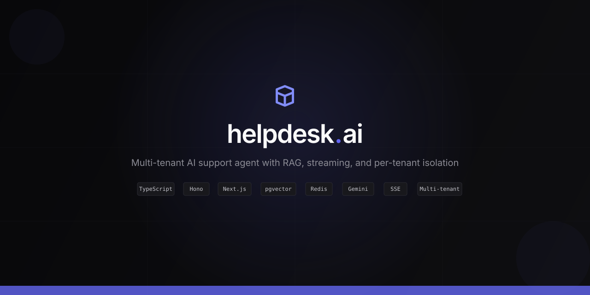

<p align="center">
  
</p>

# helpdesk-ai

A production-grade, multi-tenant AI support agent built in TypeScript. Not a chatbot — a full agent system that searches your docs, reasons over them, and cites sources.

**[Live Demo](https://helpdesk-ai-web.onrender.com)** · **[Watch Video](https://www.loom.com/share/fd1f8fffe3954805923cc802c757ac33)** · **[Source Code](https://github.com/ayushnau/helpdesk-ai)**

---

## What it does

- **Tool-calling agent loop** — searches knowledge base, reasons over results, cites sources with references
- **Multi-tenant isolation** — each customer gets their own system prompt, knowledge base, token limits, and cost tracking
- **RAG pipeline** — upload markdown docs, auto-chunk by headings, hybrid search (vector + full-text), RRF fusion
- **Streaming responses** — SSE token-by-token streaming from LLM to browser
- **Admin dashboard** — real-time token usage, conversation transcripts, prompt editor with version history, knowledge base management
- **Per-tenant cost tracking** — daily token caps, usage breakdown by hour/day, cost attribution
- **Bring your own key** — users provide their own Gemini/Groq API key via the Settings UI

---

## RAG Pipeline

```
Markdown docs → Chunk (heading-based) → Embed (Gemini/Ollama) → pgvector
                                                                      ↓
User query → Embed query → Vector search (cosine) ─┐
                         → Keyword search (tsvector) ─┤→ RRF fusion → Top-K chunks → LLM
```

Hybrid retrieval combining vector similarity + full-text search via Reciprocal Rank Fusion (RRF). Configurable weights.

---

## How a chat message flows through the system

**1. User sends a message** (from dashboard chat or embed widget)

```
Browser → POST /chat/stream (with tenant ID + session ID)
       → Hono server receives the request
```

**2. Server loads or creates the conversation**

```
Server → Redis: GET session:{sessionId}
       → If exists: load conversation history
       → If new: create fresh context with tenant's system prompt from Postgres
       → Append user's message to conversation
       → Save to Redis immediately (so it appears in dashboard conversations)
```

**3. Server runs the agent loop** (`agentTurnStream`)

```
Server → LLM (Gemini/Ollama): send conversation + available tools
       ← LLM responds with either:
          a) Text tokens (streamed one by one → SSE to browser)
          b) Tool calls (e.g. search_knowledge)
```

**4. If LLM calls a tool** (e.g. `search_knowledge`)

```
Server → SSE: "tool_start" (browser shows "searching...")
       → Embed the query (Gemini/Ollama → 768-dim vector)
       → Postgres: vector similarity search + full-text search
       → Fuse results with RRF (Reciprocal Rank Fusion)
       → Return top-K matching doc chunks to the LLM
       → SSE: "tool_end" (browser shows "found — search_knowledge")
       → LLM generates final answer using the retrieved docs
       ← Text tokens streamed to browser via SSE
```

**5. Response complete**

```
Server → Redis: save updated conversation (with assistant's response)
       → Postgres: log token usage (tenant_id, session_id, prompt/completion/total)
       → SSE: "done" (browser shows final token count)
```

**Where data lives:**

| Data | Storage | Lifetime |
|------|---------|----------|
| Conversation history | Redis (`session:{id}`) | 24h TTL, refreshed on each message |
| Tenant config + system prompt | Postgres `tenants` table, cached in Redis 1h | Permanent |
| Token usage logs | Postgres `token_usage` table | Permanent (for billing/analytics) |
| Knowledge base chunks | Postgres `chunks` table (content + vector embedding) | Permanent until deleted |
| User accounts | Postgres `users` table (bcrypt password hash) | Permanent |
| LLM API keys | Postgres `tenants.llm_api_key_encrypted` (AES-256) | Permanent, encrypted |

See [docs/sequence-flows.md](docs/sequence-flows.md) for additional flows (auth, widget embed, knowledge upload).

---

## Architecture

```
┌─────────────────────────────────────────────────────────────────┐
│                        Browser (Next.js 15)                      │
│  Landing page · Login/Signup · Dashboard · Chat (SSE streaming)  │
└──────────────────────────┬──────────────────────────────────────┘
                           │ HTTP + SSE
┌──────────────────────────▼──────────────────────────────────────┐
│                     Hono API Server                              │
│  /auth/* · /chat · /chat/stream · /admin/* · /health             │
│                                                                  │
│  ┌─────────────────────────────────────────────────────────┐     │
│  │              agent-core (agentTurnStream)                │     │
│  │  Provider abstraction · Tool registry · Memory/compress  │     │
│  │  Streaming via AsyncGenerator · Multi-tenant scoping     │     │
│  └─────────┬──────────────────────┬────────────────────────┘     │
│            │                      │                              │
│   ┌────────▼────────┐   ┌────────▼────────┐                     │
│   │  LLM Provider   │   │  search_knowledge│                     │
│   │  Gemini / Groq   │   │  (hybrid RAG)   │                     │
│   │  Ollama (local)  │   │  vector + BM25  │                     │
│   └─────────────────┘   └────────┬────────┘                     │
└──────────────────────────────────┼──────────────────────────────┘
                                   │
        ┌──────────────────────────┼──────────────────┐
        │                          │                   │
   ┌────▼─────┐            ┌──────▼──────┐     ┌─────▼─────┐
   │ Postgres  │            │   Redis     │     │  Postgres  │
   │ tenants   │            │ sessions    │     │  chunks    │
   │ users     │            │ (24h TTL)   │     │  (pgvector)│
   │ token_usage│           │ tenant cache│     │            │
   └───────────┘            └─────────────┘     └────────────┘
```

### Monorepo structure

```
helpdesk-ai/
├── apps/
│   ├── server/            Hono HTTP server (REST + SSE streaming)
│   ├── web/               Next.js 15 frontend (App Router)
│   └── api/               CLI REPL agent
├── packages/
│   ├── agent-core/        Agent loop, tools, providers, streaming, multi-tenancy
│   ├── retrieval/         Hybrid search (vector + BM25 + RRF fusion)
│   ├── ingestion/         Doc parsing, chunking, embedding pipeline
│   ├── shared/            Embedding utilities (Ollama / Gemini)
│   └── types/             Shared TypeScript types
├── data/
│   └── demo/              Demo markdown files for Acme tenant
└── docs/
    └── sequence-flows.md  Request lifecycle diagrams
```

---

## Embed in 30 seconds

Add a single script tag to any website — your customers get an AI support agent instantly:

```html
<script
  src="https://helpdesk-ai-api.onrender.com"
  data-tenant-id="acme"
  data-key="tk_acme_demo"
  data-title="Acme Support"
  data-accent="#10B981">
</script>
```

That's it. The widget handles everything — chat UI, SSE streaming, tool calls, markdown rendering.


| Attribute        | Purpose                                                    |
| ---------------- | ---------------------------------------------------------- |
| `data-tenant-id` | Which tenant's knowledge base to search                    |
| `data-key`       | Public widget token (NOT the LLM API key — safe to expose) |
| `data-title`     | Chat header title                                          |
| `data-accent`    | Brand color for the bubble and accents                     |
| `data-position`  | `right` (default) or `left`                                |


**How it works under the hood:**

1. Merchant saves their Gemini API key in the dashboard (encrypted with AES-256, stored server-side)
2. Widget loads on the merchant's site via the script tag
3. End user sends a message → widget calls `POST /widget/chat` with the public widget token
4. Server looks up the tenant by token, decrypts their API key, runs the agent, streams the response
5. End user sees the answer with citations — never sees or touches any API key

See working examples in `[examples/](examples/)` — open `posthog-site.html` or `acme-site.html` with the server running.

---

## Stack


| Layer      | Technology                                               |
| ---------- | -------------------------------------------------------- |
| Frontend   | Next.js 15 (App Router), React 19, CSS custom properties |
| Backend    | Hono, Bun                                                |
| Database   | PostgreSQL + pgvector (Supabase)                         |
| Cache      | Redis (Upstash)                                          |
| LLM        | Gemini, Groq, Ollama (local)                             |
| Embeddings | Gemini text-embedding-004 / Ollama nomic-embed-text      |
| Auth       | bcrypt (Bun.password), localStorage sessions             |
| Deployment | Render (Docker containers)                               |


---

## Features

### Agent loop

- Tool-calling with `search_knowledge` (RAG), `read_file`, `write_file`, `list_directory`, `search_text`
- Streaming via AsyncGenerator — single `agentTurnStream()` powers CLI, HTTP, and SSE
- Auto-continuation on truncated responses
- Structured error handling (5 error categories)
- Context window compression when approaching token limits

### Multi-tenancy

- Tenant-scoped knowledge base search (each tenant's docs are isolated)
- Per-tenant system prompts (editable via dashboard)
- Per-tenant daily token caps with hard limits
- Tenant config cached in Redis (1h TTL) with Postgres as source of truth
- User signup auto-creates a new tenant

### Dashboard

- **Overview** — real-time token usage (hourly/daily charts), active sessions, cost tracking
- **Prompt editor** — edit system prompt with split-view live preview, version history
- **Knowledge base** — upload .md/.mdx/.txt files, auto-chunk, view indexed documents
- **Conversations** — browse active + historical sessions, view full transcripts
- **Settings** — tenant config, daily limits, API key management, model selection

### Chat

- SSE streaming (token-by-token rendering)
- Debug sidebar (session ID, tenant, model, token count, tool calls, citations)
- Demo tenant switcher for unauthenticated users
- Markdown rendering with code blocks, lists, bold, inline citations

---

## Running locally

### Prerequisites

- Bun (v1.2+)
- PostgreSQL with pgvector extension
- Redis (or Upstash)
- Ollama with `nomic-embed-text` model (for local embeddings)

### Setup

```bash
git clone https://github.com/ayushnau/helpdesk-ai.git
cd helpdesk-ai
bun install
cp .env.example .env  # configure DATABASE_URL, REDIS_URL
```

### Database

```sql
CREATE DATABASE helpdesk_ai;
\c helpdesk_ai
CREATE EXTENSION vector;
```

The server runs `ensureSchema()` on startup which creates all tables and seeds demo tenants/users.

### Run

```bash
# Start the backend (default: Ollama)
bun run server

# Start with Gemini
bun run server gemini

# Start the frontend
bun run web:dev

# CLI agent (REPL)
bun run agent
```

### Ingest docs

```bash
bun run chunks    # Parse and chunk markdown docs
bun run embed     # Embed chunks and insert into pgvector
```

---

## Deployment

Deployed on Render with Supabase (Postgres) and Upstash (Redis).

Set these environment variables on the backend service:


| Variable       | Purpose                           |
| -------------- | --------------------------------- |
| `DATABASE_URL` | Supabase pooler connection string |
| `REDIS_URL`    | Upstash Redis URL (rediss://)     |
| `LLM_PROVIDER` | `gemini` or `groq`                |
| `CORS_ORIGINS` | Frontend URL (comma-separated)    |


The frontend needs `NEXT_PUBLIC_API_URL` as a Docker build arg (baked at build time).

---

## Demo accounts


| Email                                           | Password | Tenant    |
| ----------------------------------------------- | -------- | --------- |
| [marius@posthog.com](mailto:marius@posthog.com) | demo     | PostHog   |
| [admin@acme.com](mailto:admin@acme.com)         | demo     | Acme Corp |


Or sign up to create your own tenant.

---

## License

ISC

---

Built by [Ayush Nautiyal](https://ayushnau.github.io) · [Email](mailto:ayushnautiyaldevelopr@gmail.com) · [Twitter](https://x.com/Avicula11) · [LinkedIn](https://linkedin.com/in/ayush-nautiyal-947266177)